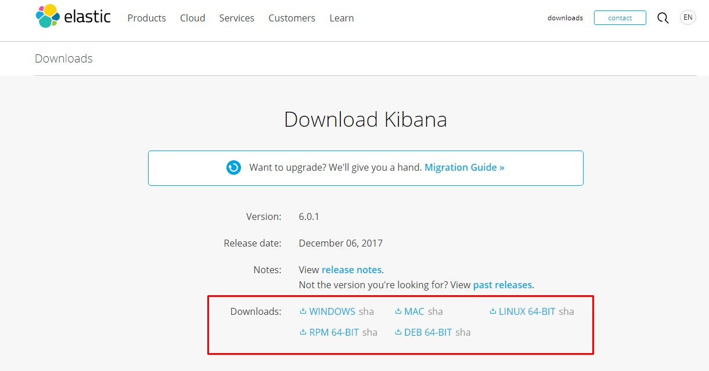

# Elasticsearch

## 前言

> 本是个web开发小生，在之前的公司接触到了Elasticsearch，出于对大数据的好奇，开始了自学，
本文参看了部分博客，慕课网视频，本着对原创敬佩的态度，贴出参考路径...

- 慕课网学习视频 **https://www.imooc.com/learn/920**
- JDK安装 **http://blog.csdn.net/wangkuangs/article/details/54232681**

## 安装/运行

###  1. 初始化

 - 成功安装jdk1.8
 
 - 下载、安装
 
```bash
    wget https://artifacts.elastic.co/downloads/elasticsearch/elasticsearch-5.6.3.tar.gz
    # 解压
    tar -zxvf elasticsearch-5.6.3.tar.gz
```

### 2. 启动

```bash

    # 新建普通用户
     groupadd elasticsearch
     useradd -m elasticsearch -g elasticsearch -d /home/elasticsearch
    
    # 修改密码
     passwd elasticsearch
    
    # 切换普通用户
    su elasticsearch
    
    # 启动
    ./bin/elasticsearch
    
```

### 3. 修改配置

- 基础配置

```bash
vi /usr/local/elasticsearch/config/elasticsearch.yml
```


- 内存配置

```bash
vi ./config/jvm.options

#修改内存配置
-Xms2g
-Xmx2g
```

### 4. 安装插件 

#### elasticsearch-head

- 下载

```bash

git clone https://github.com/mobz/elasticsearch-head.git

# 成功安装node (大于6.0)

# 初始化项目
cd elasticsearch-head
npm install

# 启动
npm run start

```

- 解决跨域问题

```bash
# 修改 elasticsearch.yml, 允许跨域, 在文件末尾添加
http.cors.enabled: true
http.cors.allow-origin: "*"
```

## 快速搭建集群

### 启动

- 启动第一个节点

```bash
./bin/elasticsearch 
```

- 启动第二个节点

```bash
./bin/elasticsearch -Ehttp.port=8200 -Epath.data=node2
```

- 启动第三个节点

```bash
./bin/elasticsearch -Ehttp.port=7200 -Epath.data=node3
```

### 查看

- 查看启动集群状态 **http://localhost:9200/_cat/nodes**

```bash
192.168.1.111 11 97 5 0.22 0.54 0.52 mdi - P6j2v_c
192.168.1.111 13 97 5 0.22 0.54 0.52 mdi - DQOqgiL
192.168.1.111 17 97 5 0.22 0.54 0.52 mdi * JPWkmUG
```


- 集群详情 ： **http://192.168.1.111:9200/_cluster/stats**

```json
{
    "_nodes": {
        "total": 3,
        "successful": 3,
        "failed": 0
    },
    "cluster_name": "elasticsearch",
    "timestamp": 1512828954692,
    "status": "green",
    "indices": {
        "count": 2,
        "shards": {
            "total": 16,
            "primaries": 8,
            "replication": 1,
            "index": {
                "shards": {
                    "min": 6,
                    "max": 10,
                    "avg": 8
                },
                "primaries": {
                    "min": 3,
                    "max": 5,
                    "avg": 4
                },
                "replication": {
                    "min": 1,
                    "max": 1,
                    "avg": 1
                }
            }
        },
        "docs": {
            "count": 6,
            "deleted": 0
        },
        "store": {
            "size_in_bytes": 59706,
            "throttle_time_in_millis": 0
        },
        "fielddata": {
            "memory_size_in_bytes": 0,
            "evictions": 0
        },
        "query_cache": {
            "memory_size_in_bytes": 0,
            "total_count": 0,
            "hit_count": 0,
            "miss_count": 0,
            "cache_size": 0,
            "cache_count": 0,
            "evictions": 0
        },
        "completion": {
            "size_in_bytes": 0
        },
        "segments": {
            "count": 12,
            "memory_in_bytes": 34228,
            "terms_memory_in_bytes": 26796,
            "stored_fields_memory_in_bytes": 3744,
            "term_vectors_memory_in_bytes": 0,
            "norms_memory_in_bytes": 2560,
            "points_memory_in_bytes": 24,
            "doc_values_memory_in_bytes": 1104,
            "index_writer_memory_in_bytes": 0,
            "version_map_memory_in_bytes": 0,
            "fixed_bit_set_memory_in_bytes": 0,
            "max_unsafe_auto_id_timestamp": -1,
            "file_sizes": {}
        }
    },
    "nodes": {
        "count": {
            "total": 3,
            "data": 3,
            "coordinating_only": 0,
            "master": 3,
            "ingest": 3
        },
        "versions": [
            "5.6.2"
        ],
        "os": {
            "available_processors": 6,
            "allocated_processors": 6,
            "names": [
                {
                    "name": "Linux",
                    "count": 3
                }
            ],
            "mem": {
                "total_in_bytes": 11113943040,
                "free_in_bytes": 400244736,
                "used_in_bytes": 10713698304,
                "free_percent": 4,
                "used_percent": 96
            }
        },
        "process": {
            "cpu": {
                "percent": 0
            },
            "open_file_descriptors": {
                "min": 196,
                "max": 204,
                "avg": 199
            }
        },
        "jvm": {
            "max_uptime_in_millis": 1287394,
            "versions": [
                {
                    "version": "1.8.0_144",
                    "vm_name": "Java HotSpot(TM) 64-Bit Server VM",
                    "vm_version": "25.144-b01",
                    "vm_vendor": "Oracle Corporation",
                    "count": 3
                }
            ],
            "mem": {
                "heap_used_in_bytes": 480286304,
                "heap_max_in_bytes": 3168927744
            },
            "threads": 93
        },
        "fs": {
            "total_in_bytes": 484573421568,
            "free_in_bytes": 443235115008,
            "available_in_bytes": 418596622336
        },
        "plugins": [],
        "network_types": {
            "transport_types": {
                "netty4": 3
            },
            "http_types": {
                "netty4": 3
            }
        }
    }
}
```

## 下载安装kibana

### 下载

- 地址**https://www.elastic.co/downloads/kibana**，目前我使用的是**Debian 64位**，根据自己的系统，对应下载。



```bash
wget https://artifacts.elastic.co/downloads/kibana/kibana-6.0.1-linux-x86_64.tar.gz
```

### 修改配置


```bash
vi ./config/kibana.yml

# 修改 elasticsearch 路径地址
elasticsearch.url = 'http://localhost:9200'
```

### 启动

```bash
./bin/kibana -H 0.0.0.0 -p 5601
```

### 功能介绍


## beat

### 介绍


### FileBeat 


## 问题

### 使用问题

### 安装配置问题

- 1、can not run elasticsearch as root 

```bash
# 切换到非root用户
```

- 2、main ERROR Could not register mbeans java.security.AccessControlException: access denied ("javax.management.MBeanTrustPermission" "register")

```bash
# 改变elasticsearch文件夹所有者到当前用户
sudo chown -R noroot:noroot elasticsearch
```

- 3、max virtual memory areas vm.max_map_count [65530] is too low, increase to at least [262144]

```bash
sudo vi /etc/sysctl.conf 
# 添加下面配置：
vm.max_map_count=655360
# 并执行命令：
sudo sysctl -p
```
- 4、max file descriptors [4096] for elasticsearch process is too low, increase to at least [65536]

```bash

sudo vi /etc/security/limits.conf

# 添加如下内容:
* soft nofile 65536
* hard nofile 131072
* soft nproc 2048
* hard nproc 4096

sudo vi /etc/pam.d/common-session
添加 session required pam_limits.so

sudo vi /etc/pam.d/common-session-noninteractive
添加 session required pam_limits.so

```


    
