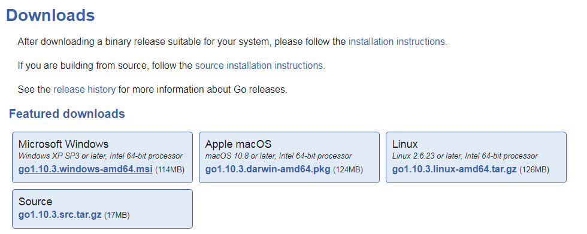

# GO

## 安装

- [下载地址](https://golang.google.cn/dl/)

- 下载页面，本教程使用`go1.10.3.linux-amd64.tar.gz`

  
  
- 安装环境Debian

```bash
$ wget https://dl.google.com/go/go1.10.3.linux-amd64.tar.gz
```  
  
- 解压

```bash
$ tar -C /usr/local -zxvf go1.10.3.linux-amd64.tar.gz
```

- 修改环境变量

```bash
export PATH=$PATH:/usr/local/go/bin
```

- 测试，创建文件`test.go`

```go
package main

import "fmt"

func main() {
   fmt.Println("Hello, World!")
}
```
 
执行

```bash
$ go run test.go
```

## 开始

### 1. 变量赋值

- 变量的多种申明赋值方式

```go
package main

// import something
import "fmt"

func main() {

	// 申明变量，并申明变量类型
	var power int
	// 申明后赋值
	power = 2323

	// 使用短变量声明运算符，自动推断变量类型，必须是新变量
	proName := "test name"

	// 必须保证其中一个为新变量即可，但不能改变旧变量的类型
	name, power := "test", getPower()

	fmt.Printf("%s's It's over %d\n", name, power)

	// 当变量申明但未使用时报错 "proName declared and not used"
	fmt.Println(proName)
	
	// 同样的 import 也不允许导入一个未使用的代码包，否则会编译失败
}

// 从函数中获取变量值
func getPower() int {
	return 900
}

```

- 

### 2. 命令解析

- 命令 `go run`

令已经包含了编译和运行,它使用一个临时目录来构建程序，
执行完然后清理掉临时目录

```go
$ go run test.go
```

查看临时文件的位置

```go 
$ go run --work test.go
```


- 编译代码,产生一个可执行文件，win下名为 test.exe, linux下名为 test

```go
$ go build test.go
```

  